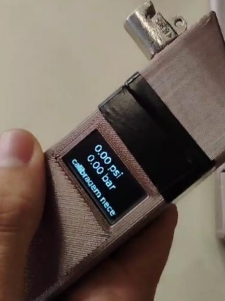
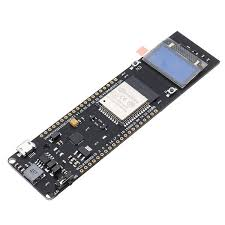
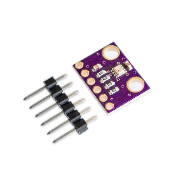
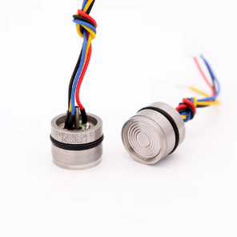
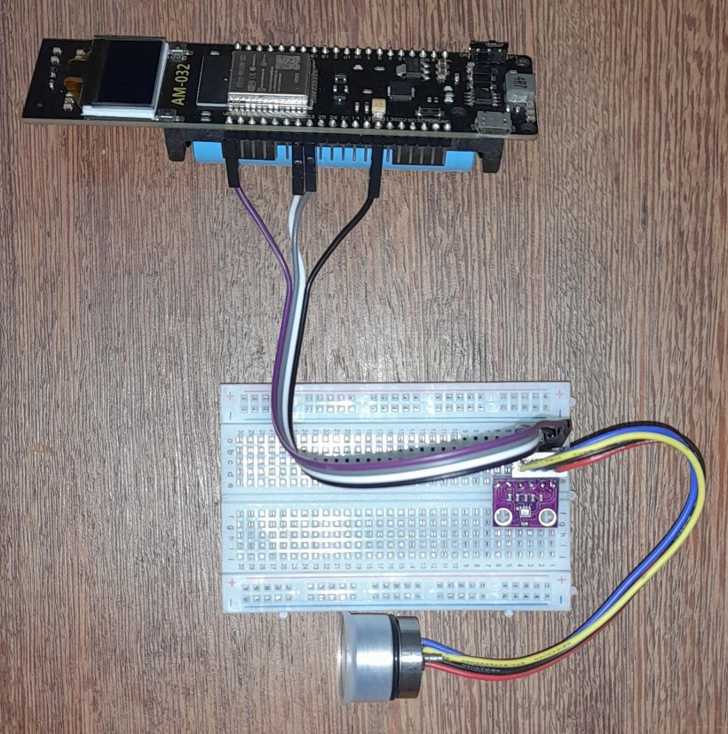

# Aferidor de Pressão para Pneus 🚗💨



## 📝 Sobre o Projeto

Este projeto é desenvolvido como parte de um **trabalho universitário**, apresentando um **protótipo real de aferidor de pressão para pneus**. Ele integra conceitos de **engenharia, eletrônica e desenvolvimento web** para demonstrar de forma prática como medir a pressão dos pneus de um veículo, com precisão e sustentabilidade.

O site contém informações sobre:

- Importância da aferição correta dos pneus 🛞
- Sustentabilidade no desenvolvimento do produto 🌱
- Especificações técnicas e montagem do protótipo ⚙️
- Calculadora digital para simular medições de pressão 🖥️
- Referências acadêmicas e fontes de pesquisa 📚

---

## 🔧 Tecnologias e Componentes

### Tecnologias Web
- HTML5
- CSS3
- JavaScript

### Componentes do Protótipo
- **ESP32 TTGO com Display OLED**
- **Sensor BMP280** (temperatura e pressão barométrica)
- **Sensor SMP3011** (pressão de fluidos)
- Protoboard, cabos e bateria Li-Ion 18650
- **Autodesk Fusion 360** para design do encapsulamento
- Impressão 3D para protótipo físico

---

## 📐 Estrutura do Projeto

```

├── index.html          # Página principal do projeto
├── produto.html        # Especificações e montagem do aferidor
├── escopo.html         # Definição do escopo e análise SWOT
├── CSS/
│   └── styles.css      # Estilos da página
├── Imagens/            # Imagens do protótipo e componentes
├── script.js           # Lógica da calculadora de pressão
└── README.md           # Este arquivo

```

---

## ⚙️ Funcionalidades do Protótipo

- Medição de pressão de pneus em **tempo real**
- Exibição da pressão em **unidades PSI e Bar**
- Alertas visuais e sonoros de pressão inadequada
- Registro de leituras para histórico do usuário
- Calibração automática com função **Autozero**
- Montagem portátil e de fácil manuseio
- Sustentabilidade: material biodegradável e bateria recarregável 🔋

---

## 📸 Galeria do Protótipo

### ESP32 TTGO com OLED


### Sensor BMP280


### Sensor SMP3011


### Protótipo Montado


---

## 🌱 Sustentabilidade

- O protótipo utiliza **material biodegradável** na impressão 3D.
- Bateria recarregável de longa duração.
- Impressão terceirizada para **reduzir desperdício e otimizar recursos**.

---

## 🖥️ Interatividade

- A página possui uma **calculadora de pressão**, permitindo que usuários insiram valores e convertem entre PSI e Bar.
- Fácil navegação entre seções: importância, imagens, sustentabilidade, conclusão e referências.

---

## 🎯 Objetivo Acadêmico

- Aplicar conhecimentos de **engenharia de software e sistemas embarcados**
- Criar um **MVP funcional** com baixo custo
- Demonstrar **documentação técnica e apresentação web** de um projeto real
- Integrar conceitos de **sustentabilidade, precisão e portabilidade**

---

## 📚 Referências

- [Asana: O que é escopo de projeto](https://asana.com/pt/resources/project-scope)  
- [Mestres da Web: Requisitos Funcionais e Não Funcionais](https://www.mestresdaweb.com.br/tecnologias/requisitos-funcionais-e-nao-funcionais-o-que-sao)  
- [Dantas, C.: Medidor de pressão ESP32](https://github.com/cadantas33/medidor-pressao-esp32?tab=readme-ov-file)  
- [Bosch: BMP280 - Pressure Sensors](https://www.bosch-sensortec.com/products/environmental-sensors/pressure-sensors/bmp280/)  
- [Autodesk Fusion 360](https://www.autodesk.com/products/fusion-360/)

---

## 👤 Autor

Leandro Pinheiro dos Santos – 2025  
Trabalho Universitário / Projeto Real de Engenharia

---

> Para mais informações, acesse as páginas internas do projeto: [Escopo](escopo.html) | [Especificações](produto.html) | [Vídeos do Projeto](video.html)
